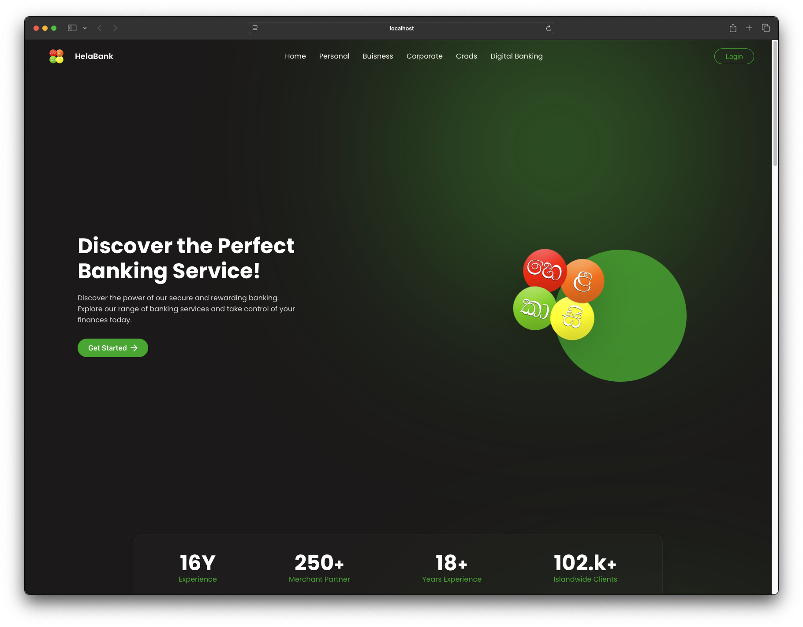
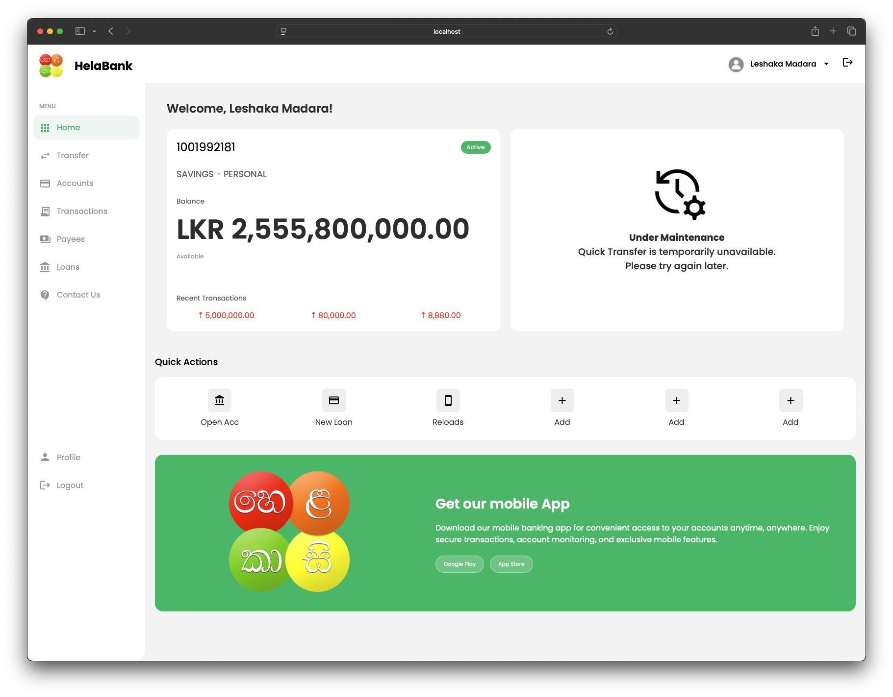
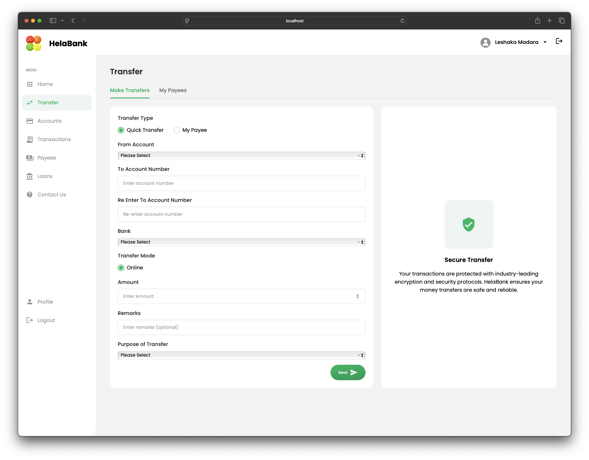
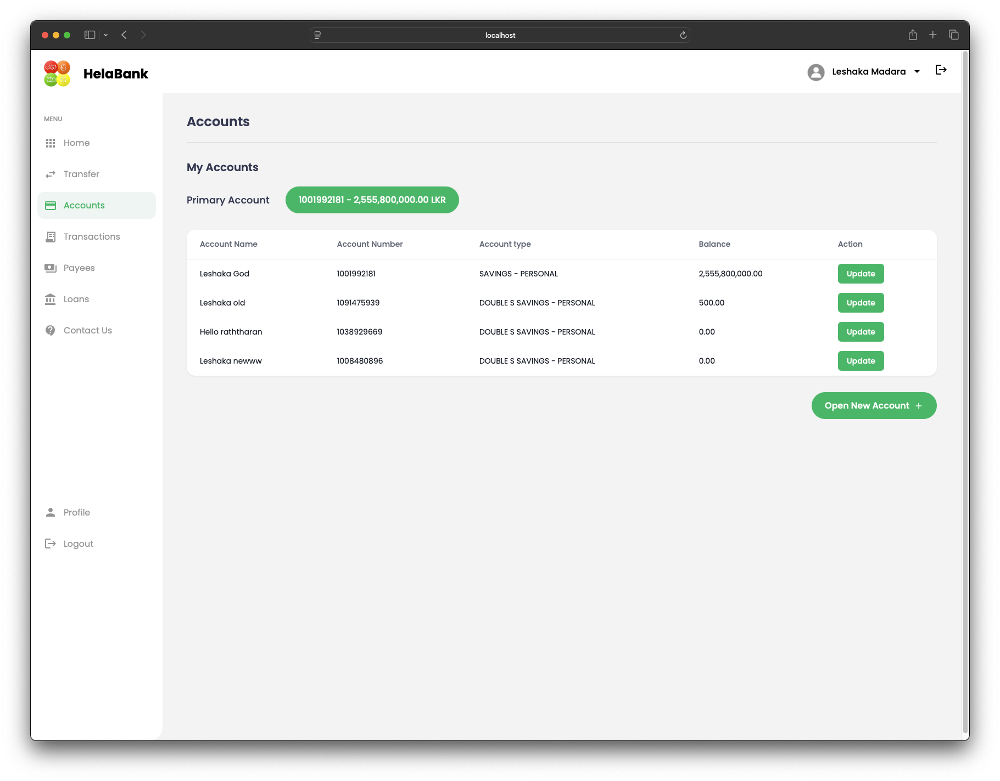
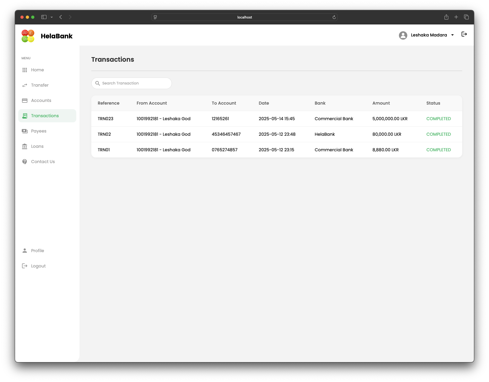
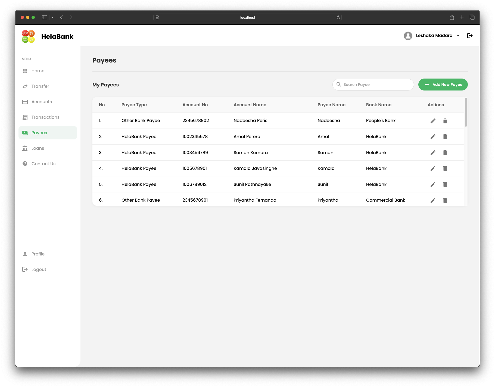
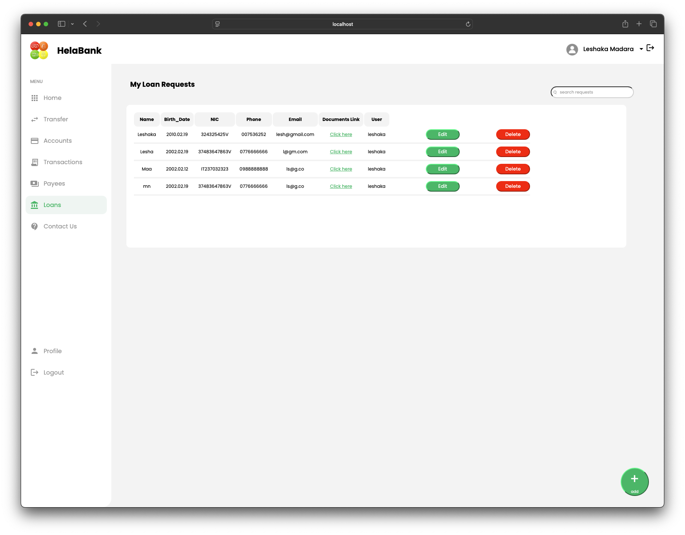
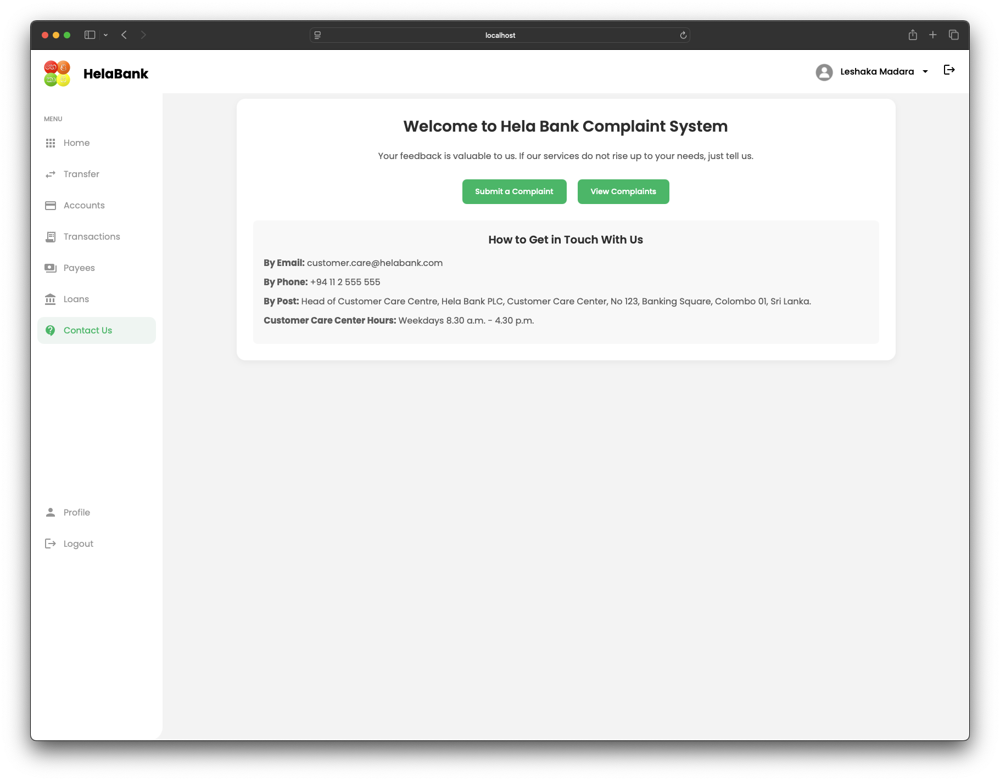
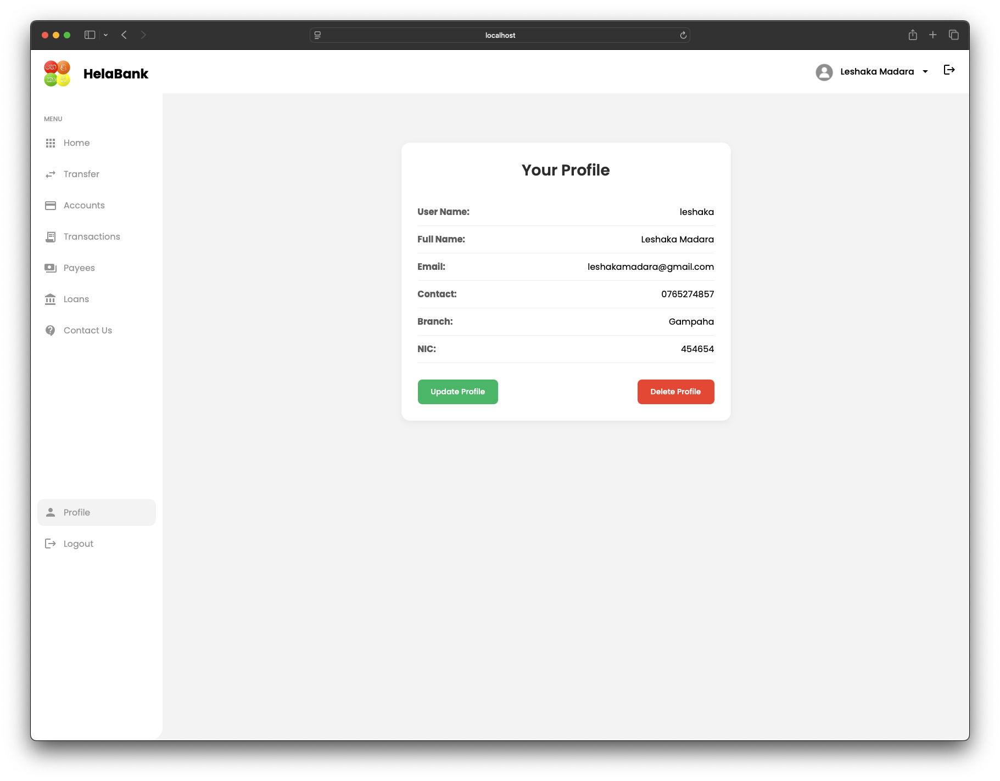

# 💳 Online Banking System

An academic project developed for the **2nd Year – Semester 1** on **Object-Oriented Programming (OOP)**. This web-based **Online Banking System** simulates real-world banking operations and demonstrates the practical application of OOP principles using the **Java MVC architecture**.

---

## 🚀 Features

- 🖥️ **Clean and Interactive UI/UX**
- 
- 🔐 Secure Login & Registration (with password hashing)
- 🧾 Account Overview – View balances and manage multiple accounts
- 💳 Fund Transfer – Easily send money between accounts
- 👥 Beneficiary Management – Add, update, and remove payees
- 📈 Transaction History – View detailed records of all activities
- 🏦 Loan Services – Request, view, and manage loans
- 🛎️ Support System – Submit and track complaints
- 🛠️ Admin Panel – Manage users, complaints, and transactions

---

## 🛠 Technologies Used

| Layer      | Technologies Used                          |
|------------|--------------------------------------------|
| Frontend   | HTML, CSS, JSP                             |
| Backend    | Java (Servlets), JDBC                      |
| Database   | MySQL                                      |
| Architecture | MVC (Model-View-Controller)              |
| IDE        | Eclipse IDE                                |
| Server     | Apache Tomcat                              |

---

## 📸 Screenshots

> 
> 
> 
> 
> 
> 
> 
> 
> 
> 

---

## 🧠 OOP Concepts Applied

- ✅ **Encapsulation**: Model classes
- ✅ **Abstraction**: Interface-driven structure
- ✅ **Inheritance**: Common base classes for Users
- ✅ **Polymorphism**: Method overloading and overriding

---

## 📁 Project Structure

```.
├── build
│   └── classes
│       └── com
│           └── banking
└── src
    └── main
        ├── java
        │   └── com
        └── webapp
            ├── ConTestDB.jsp
            ├── Login.jsp
            ├── META-INF
            ├── Profile.jsp
            ├── SignUp.jsp
            ├── Test.jsp
            ├── Update.jsp
            ├── WEB-INF
            ├── add-complaint.jsp
            ├── adminHome.jsp
            ├── adminLogin.jsp
            ├── connectionTest.jsp
            ├── css
            ├── deletereq.jsp
            ├── edit-complaint.jsp
            ├── favicon.ico
            ├── home.jsp
            ├── images
            ├── index.jsp
            ├── js
            ├── landing.html
            ├── landing.jsp
            ├── list-complaints.jsp
            ├── read.jsp
            ├── transferMoney.jsp
            ├── transferMoneyPayee.jsp
            ├── updateloan.jsp
            ├── userAccounts.jsp
            ├── userAddNewPayee.jsp
            ├── userDashboard.jsp
            ├── userEditAccount.jsp
            ├── userEditPayee.jsp
            ├── userMyPayee.jsp
            ├── userOpenAccounts.jsp
            ├── userTransactions.jsp
            ├── videos
            └── view-complaint.jsp
```
---


## ⚙️ How to Run the Project

### 🔧 Prerequisites

- JDK 11+
- MySQL Server
- Apache Tomcat 9+ with mysql-connector-j-9.1.0.jar
- Eclipse IDE (with Dynamic Web Project support)

### 📦 Setup Steps

1. **Clone the Repository**
   ```bash
   git clone https://github.com/leshakamadara/OOP-Online_Banking_System.git

---

   Authors

•	LEEE
•	Sanothan P
•	Muween
•	Gajendra


**This project is developed as a part of university coursework and is intended for educational purposes only.**
